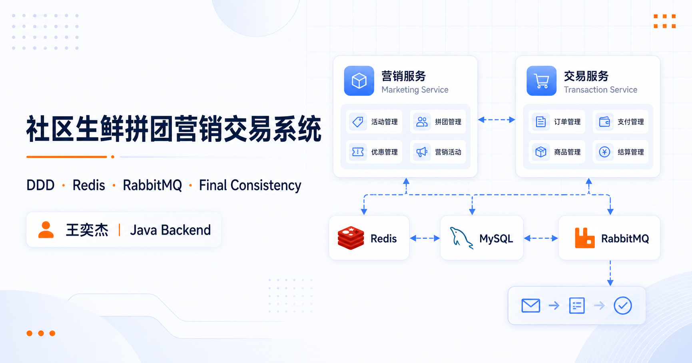
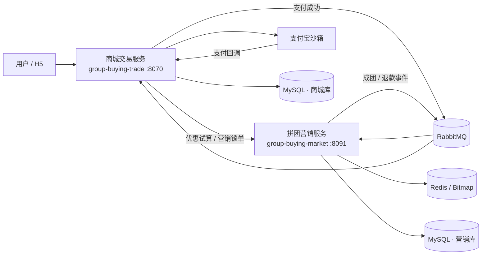
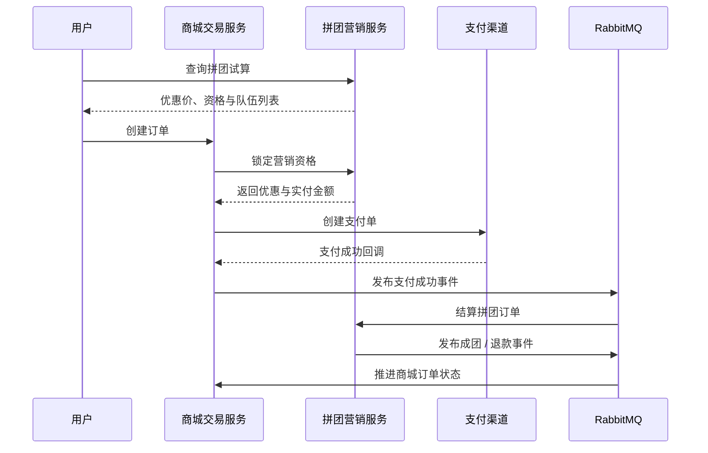

<div align="center">

# Community Group Buying Platform

### 社区生鲜拼团营销交易系统

一套覆盖 **优惠试算、组队锁单、支付结算、成团履约与退款补偿** 的 DDD 双微服务项目。

[](https://github.com/wangyijie01/group-buying-platform/actions/workflows/backend-ci.yml)
[](#技术栈)
[](#技术栈)
[](#技术栈)
[](#技术栈)
[](#技术栈)
[](LICENSE)

**[在线项目档案](https://wangyijie01.github.io/group-buying-platform/)** · [架构设计](#架构设计) · [核心设计](#核心设计) · [快速开始](#快速开始) · [运维手册](docs/operations.md) · [测试说明](docs/testing.md)



</div>

> [!NOTE]
> 项目负责人：**王奕杰**，西北工业大学人工智能硕士在读，求职方向为 Java 后端开发 / Agent 工程。项目周期为 **2025.05 - 2025.08**。本仓库用于展示复杂交易业务建模、并发控制与最终一致性实践，不包含生产凭据。

## 项目概览

社区团购的难点不止是“多人凑单”，还包括营销资格、支付订单、队伍人数与退款状态在两个服务之间的可靠协同。项目按业务边界拆为：

- `group-buying-trade`：商品下单、营销锁单、支付宝支付、支付回调、订单状态与退款执行。
- `group-buying-market`：活动试算、人群过滤、开团参团、队伍结算、成团通知与逆向补偿。

| 项目维度 | 当前实现 |
| --- | --- |
| 业务闭环 | 浏览试算 → 锁单 → 支付 → 结算 → 成团 → 履约 → 退款 |
| 领域模型 | 活动、人群标签、拼团交易、商城订单、支付授权 |
| 并发控制 | Redis 原子计数 + 序号幂等键 + MySQL 条件更新兜底 |
| 最终一致性 | 本地任务表 + RabbitMQ / HTTP + 定时补偿 + 幂等状态机 |
| 消息可靠性 | 消费端 3 次退避重试 + 5 个业务队列的独立 `.dlq` |
| 可观测性 | `X-Trace-Id`、Actuator 健康探针、Prometheus 指标 |
| 工程验证 | 根聚合构建、15 个 Maven 模块、11 个自动化测试、GitHub Actions |

## 简历推荐写法

- 基于规则树编排营销试算，将系统控制、活动/SKU 加载、优惠计算与人群过滤拆为独立节点，并用线程池并行加载活动和商品数据，使新增优惠策略无需改动主流程。
- 抽象锁单、结算、退款 3 条责任链，组合活动可用性、队伍名额、参与次数与状态幂等校验；采用 Redis 原子计数预占热点名额，并以 MySQL `lock_count < target_count` 条件更新兜底防超卖。
- 将业务状态与通知任务在本地事务中一并落库，通过 RabbitMQ / HTTP 投递；配置消费端 3 次退避重试与独立死信队列，结合 Redisson 抢占、定时扫描和最多 5 次任务补偿，使成团与退款事件可追踪、可恢复。
- 完成双服务工程化治理：外置数据库/Redis/RabbitMQ/支付配置，提供一键 Compose 基础环境、跨服务 `X-Trace-Id`、健康检查与 Prometheus 指标，并以 GitHub Actions 持续验证 15 个模块和 11 个自动化测试。

> 以上表述只使用代码、配置与测试可验证的事实。未提供压测报告前，不写“提升吞吐量”“降低 P99”等量化结论。

## 功能特性

- **营销试算**：根据商品、渠道、活动与用户标签计算原价、优惠金额和实付价。
- **开团参团**：校验活动状态、参与次数与队伍名额，完成营销资格预占。
- **人群运营**：标签定义、任务跑批、结果落库，并同步 Redis Bitmap 做在线位判断。
- **支付闭环**：创建支付单、处理支付宝回调、主动查单并推进营销结算。
- **可靠通知**：成团结果支持 HTTP / MQ 双通道，本地任务表记录重试状态。
- **退款逆向**：区分未支付、已支付未成团、已支付已成团三类策略。
- **动态治理**：Redis 发布订阅刷新降级开关、灰度比例与黑名单配置。

## 架构设计



两个服务均采用 DDD 分层：

```text
api             对外接口契约、DTO 与统一响应
app             Spring Boot 入口、配置与资源
domain          聚合、实体、值对象、领域服务与仓储接口
infrastructure  DAO、MyBatis、Redis、MQ 与外部网关实现
trigger         HTTP Controller、Job、Listener
types           通用异常、枚举、事件与设计模式组件
```

## 核心业务链路



## 核心设计

### 1. 规则树编排营销试算

系统开关、活动/SKU 加载、优惠计算与人群过滤分别落在独立节点。活动和 SKU 使用线程池并行加载；新增营销规则时扩展节点或策略，不重写主流程。

### 2. 责任链拆分交易校验

锁单链处理活动可用性、队伍库存和参与次数；结算链校验外部订单、渠道来源与队伍状态；退款链完成数据加载、幂等判断与逆向策略路由。

### 3. Redis 与 MySQL 双层防超卖

Redis 原子计数器承担热点名额预占，序号幂等键拦截重复预占；数据库通过 `lock_count < target_count` 条件更新提供最终约束。锁单落库失败时登记恢复量，避免缓存名额泄漏。

### 4. 本地任务表与消息死信

业务状态和 `notify_task` 在本地事务中一并落库，再通过 HTTP 或 RabbitMQ 通知下游。消费者失败后执行最多 3 次退避重试，仍失败则进入各自 `.dlq`；本地失败任务由 Redisson 锁保护的定时作业扫描，最多补偿 5 次，并通过条件更新限制状态迁移。

### 5. Bitmap 支撑人群判断

标签任务将结果持久化到明细表并同步 Redis Bitmap。在线试算执行位判断；活动标签控制参与资格，折扣标签控制定向优惠。

### 6. DCC 动态配置

通过注解、反射与 Redis 发布订阅，将降级、灰度和黑名单配置映射到业务字段，实现运行期刷新。

## 项目结构

```text
group-buying-platform/
├── group-buying-market/          # 拼团营销服务（6 个子模块）
├── group-buying-trade/           # 商城交易服务（6 个子模块）
├── .github/workflows/            # 后端 CI 与 Pages 发布
├── .mvn/                         # 项目级 Maven 参数与仓库配置
├── compose.yaml                  # MySQL、Redis、RabbitMQ 基础环境
├── docs/                         # 浅色项目档案与工程文档
├── .env.example                  # 环境变量清单
├── pom.xml                       # 双服务聚合构建入口
└── NOTICE.md                     # 来源与贡献边界
```

## 技术栈

| 类别 | 技术 |
| --- | --- |
| 后端 | Java 8、Spring Boot 2.7.18、Spring MVC、MyBatis、Maven |
| 数据 | MySQL 8、Redis / Redisson、Redis Bitmap |
| 消息 | RabbitMQ、Spring Event、HTTP 回调、DLQ |
| 架构 | DDD、聚合、仓储、防腐层、规则树、责任链、策略模式 |
| 工程 | Docker Compose、GitHub Actions、Actuator、Prometheus |

## 快速开始

### 环境要求

- JDK 8+
- Maven 3.6+
- Docker Desktop 与 Docker Compose v2

### 1. 准备本地配置

```powershell
Copy-Item .env.example .env
```

`.env` 已被 Git 忽略。支付默认关闭；需要联调支付宝沙箱时，再设置 `ALIPAY_ENABLED=true` 并填入沙箱凭据。

### 2. 启动基础设施

```bash
docker compose up -d
```

首次启动会自动创建并初始化两个 MySQL 数据库，同时启动 Redis 与带管理台的 RabbitMQ。更完整的检查、死信处理与故障排查见 [运维手册](docs/operations.md)。

### 3. 构建并运行测试

```bash
mvn -B -ntp verify
```

该命令从根目录验证 15 个 Maven 模块和 11 个自动化测试。测试范围和历史集成测试说明见 [测试说明](docs/testing.md)。

### 4. 启动两个服务

```bash
mvn -f group-buying-market/pom.xml -pl group-buying-market-app -am spring-boot:run -Dspring-boot.run.profiles=dev
mvn -f group-buying-trade/pom.xml -pl group-buying-trade-app -am spring-boot:run -Dspring-boot.run.profiles=dev
```

默认端口：营销服务 `8091`，交易服务 `8070`。健康检查分别位于 `/actuator/health`，Prometheus 指标位于 `/actuator/prometheus`。

## 工程保障

- **配置安全**：数据库、中间件、回调地址和支付凭据全部支持环境变量覆盖；仓库只保留示例值。
- **持续集成**：后端代码或 POM 变化时，GitHub Actions 在 Java 8 下分别验证两个服务。
- **依赖维护**：Dependabot 每月检查两个 Maven 工程和 GitHub Actions。
- **运行诊断**：响应返回 `X-Trace-Id`；只公开 `health`、`info`、`prometheus` 三类 Actuator 端点。
- **消息恢复**：每个业务队列都绑定专用 DLQ；处置步骤记录在 [运维手册](docs/operations.md#死信队列处理)。
- **协作规范**：漏洞报告见 [SECURITY.md](SECURITY.md)，本地贡献流程见 [CONTRIBUTING.md](CONTRIBUTING.md)。

## 项目贡献与说明

王奕杰在本作品集版本中完成：

- 整合商城交易与拼团营销双微服务，补齐交易、结算和退款链路。
- 统一源码署名与 Javadoc，重写规则树、库存、补偿和退款关键注释。
- 修复退款幂等 TTL、补偿锁租约与调度周期，收紧通知任务状态流转。
- 增加消息重试 / DLQ、批任务故障隔离、跨服务 Trace ID、健康检查和指标端点。
- 外置运行配置，提供统一 Compose 基础环境、根聚合构建、自动化测试与后端 CI。
- 重写 README、工程文档、简历 bullet 和浅色 GitHub Pages 项目档案。

本项目在既有教学工程基础上完成学习、整合与工程化维护，原始实现与当前维护范围见 [NOTICE.md](NOTICE.md)。面试或二次传播时请如实说明贡献边界。

## Roadmap

- [ ] 使用 Testcontainers 覆盖 MySQL、Redis 与 RabbitMQ 集成测试
- [ ] 增加接口幂等令牌与热点活动限流
- [ ] 接入 OpenTelemetry，补充跨进程 Trace 上下文传播
- [ ] 提供 DLQ 可视化查询与受控重放后台
- [ ] 补齐 OpenAPI / Knife4j 接口文档
- [ ] 评估 Java 17 + Spring Boot 3 的独立迁移分支

---

<div align="center">

**王奕杰 · Java Backend / Agent Engineer**

[GitHub](https://github.com/wangyijie01) · [在线项目档案](https://wangyijie01.github.io/group-buying-platform/)

</div>
