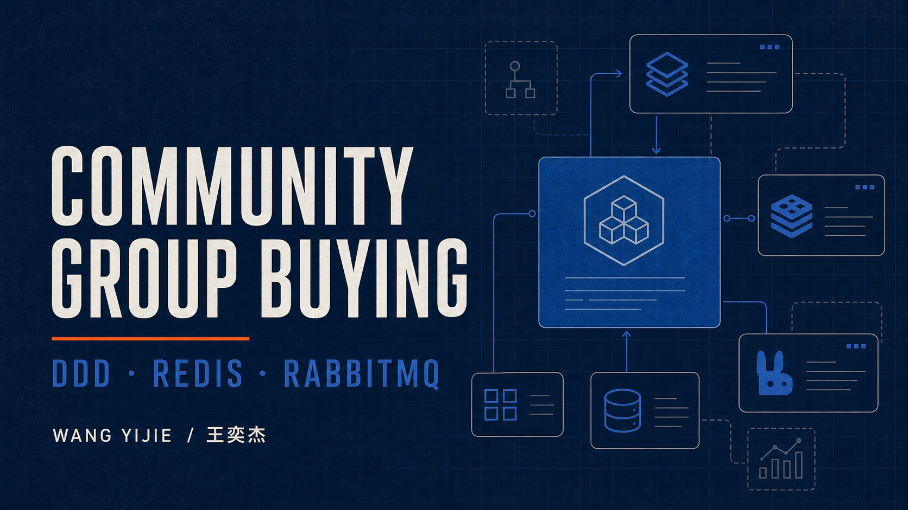
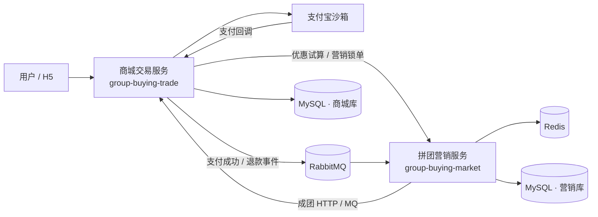
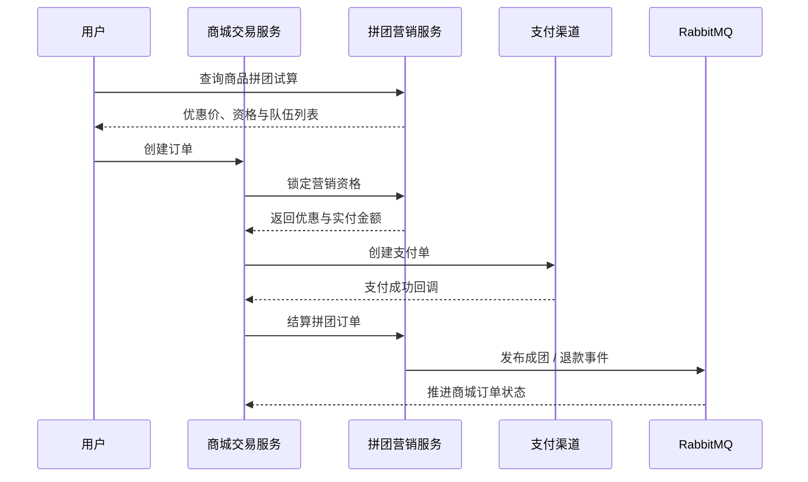

<div align="center">

# Community Group Buying Platform

### 社区生鲜拼团营销交易系统

一套覆盖 **优惠试算、组队锁单、支付结算、成团通知与退款补偿** 的 DDD 双微服务项目。

[](#技术栈)
[](#技术栈)
[](#技术栈)
[](#技术栈)
[](#技术栈)
[](#架构设计)

**[在线项目档案](https://wangyijie01.github.io/group-buying-platform/)** · [架构设计](#架构设计) · [核心设计](#核心设计) · [快速开始](#快速开始) · [项目贡献](#项目贡献与说明)



</div>

> [!NOTE]
> 项目负责人：**王奕杰**，西北工业大学人工智能硕士在读，求职方向为 Java 后端开发 / Agent 工程。项目周期为 **2025.05 - 2025.08**。本仓库用于展示复杂交易业务建模、缓存并发控制与最终一致性实践，不包含生产凭据。

## 项目概览

社区团购的难点并不止“多人凑单”，而是如何让营销资格、支付订单、队伍人数和退款状态在两个服务间可靠协同。本项目将系统拆为商城交易与拼团营销两个边界清晰的微服务：

- `group-buying-trade`：商品下单、营销锁单、支付宝支付、支付回调、订单状态与退款执行。
- `group-buying-market`：活动试算、人群过滤、开团参团、队伍结算、成团通知和逆向补偿。

| 项目维度 | 实现方案 |
| --- | --- |
| 业务范围 | 浏览试算 → 锁单 → 支付 → 结算 → 成团 → 履约 → 退款 |
| 领域模型 | 活动、人群标签、拼团交易、商城订单、支付授权 |
| 并发控制 | Redis 原子计数 + 分段锁键 + MySQL 条件更新兜底 |
| 一致性 | 本地任务表 + RabbitMQ + 定时补偿 + 幂等状态机 |
| 扩展机制 | 规则树、责任链、策略模式、DCC 动态配置 |

## 功能特性

- **营销试算**：根据商品、渠道、活动和用户标签计算原价、优惠金额与实付价。
- **开团参团**：校验活动状态、参与次数与队伍名额，完成营销资格预占。
- **人群运营**：标签定义、任务跑批、结果落库，并同步到 Redis Bitmap 做在线判断。
- **支付闭环**：创建支付单、处理支付宝回调、主动查单并推进营销结算。
- **可靠通知**：成团结果支持 HTTP / MQ 双通道，本地任务表记录重试状态。
- **退款逆向**：区分未支付未成团、已支付未成团、已支付已成团三类策略。
- **动态治理**：Redis 发布订阅刷新降级开关、灰度比例和黑名单等业务配置。

## 架构设计



两个服务均采用 DDD 分层：

```text
api             对外接口契约、DTO 与统一响应
app             Spring Boot 入口、配置与资源文件
domain          聚合、实体、值对象、领域服务与仓储接口
infrastructure  DAO、MyBatis、Redis、MQ 与外部网关实现
trigger         HTTP Controller、Job、Listener
types           通用异常、枚举、事件与设计模式组件
```

## 核心业务链路



完整流程可拆为八个阶段：运营配置、首页试算、下单锁单、支付回调、拼团结算、成团履约、定时补偿、退款逆向。

## 核心设计

### 1. 规则树编排营销试算

将系统开关、活动与商品加载、优惠计算、人群标签过滤拆成独立节点。活动数据和 SKU 数据使用线程池并行加载，新增营销规则时只需扩展节点或策略，无需重写主流程。

### 2. 责任链拆分交易校验

锁单链依次处理活动可用性、队伍库存和用户参与次数；结算链校验外部订单、渠道来源与队伍状态；退款链先加载数据、执行幂等判断，再路由到对应逆向策略。

### 3. Redis 与 MySQL 双层防超卖

Redis 原子计数器负责热点名额的快速预占，分段锁键提供异常重复值兜底；数据库使用条件更新保证最终人数不越界。锁单落库失败时记录恢复量，避免缓存名额泄漏。

### 4. 本地任务表保障最终一致性

成团与退款先在本地事务中更新业务状态并写入 `notify_task`，再通过 HTTP 或 RabbitMQ 通知下游。失败任务由定时作业扫描重试，集群执行使用 Redisson 分布式锁避免重复调度。

### 5. Bitmap 支撑高频人群判断

标签任务将结果持久化到明细表，并同步到 Redis Bitmap。在线试算只执行位判断，减少对标签明细表的高频查询；活动标签控制可见性与参与资格，折扣标签控制定向优惠。

### 6. DCC 动态配置

通过注解、反射和 Redis 发布订阅，将降级开关、灰度比例、黑名单等配置映射到业务字段，实现无需重启的秒级刷新。

## 项目结构

```text
group-buying-platform/
├── group-buying-market/          # 拼团营销服务
│   ├── group-buying-market-api
│   ├── group-buying-market-app
│   ├── group-buying-market-domain
│   ├── group-buying-market-infrastructure
│   ├── group-buying-market-trigger
│   └── group-buying-market-types
├── group-buying-trade/           # 商城支付交易服务
│   ├── group-buying-trade-api
│   ├── group-buying-trade-app
│   ├── group-buying-trade-domain
│   ├── group-buying-trade-infrastructure
│   ├── group-buying-trade-trigger
│   └── group-buying-trade-types
├── docs/                          # GitHub Pages 项目档案
├── .env.example                   # 环境变量清单
└── NOTICE.md                      # 来源与贡献说明
```

## 技术栈

| 类别 | 技术 |
| --- | --- |
| 后端 | Java 8、Spring Boot 2.7.12、MyBatis、Maven |
| 数据 | MySQL 8、Redis / Redisson、Redis Bitmap |
| 消息 | RabbitMQ、Spring Event、HTTP 回调 |
| 架构 | DDD、聚合、仓储、防腐层、规则树、责任链、策略模式 |
| 工程 | Docker Compose、Nginx、Prometheus、Grafana、ELK |

## 快速开始

### 环境要求

- JDK 8+
- Maven 3.8+
- MySQL 8.0+
- Redis 6.x+
- RabbitMQ 3.x+

### 1. 配置环境变量

参考 [.env.example](.env.example) 配置数据库、中间件、微信与支付宝沙箱参数。仓库内不保存任何真实密钥；未配置支付凭据时，外部支付测试会自动跳过。

### 2. 初始化数据库

分别创建营销库与商城交易库，并执行两个服务 `docs/dev-ops/mysql/sql` 下的初始化脚本。

### 3. 构建服务

```bash
mvn -f group-buying-market/pom.xml clean package -DskipTests
mvn -f group-buying-trade/pom.xml clean package -DskipTests
```

### 4. 启动服务

```bash
# 拼团营销服务，默认端口 8091
mvn -f group-buying-market/pom.xml -pl group-buying-market-app -am spring-boot:run -Dspring-boot.run.profiles=dev

# 商城交易服务，默认端口 8070
mvn -f group-buying-trade/pom.xml -pl group-buying-trade-app -am spring-boot:run -Dspring-boot.run.profiles=dev
```

## 项目贡献与说明

王奕杰在本作品集版本中完成：

- 整合商城交易与拼团营销两个微服务，补齐最新交易、结算和退款链路。
- 统一 185 处 Java 文件署名说明，将 164 处非标准 Javadoc 标签规范化。
- 重写关键领域注释，覆盖规则树、责任链、库存预占、补偿和退款状态机。
- 清理公开配置中的敏感凭据，改为环境变量，并增加支付测试跳过机制。
- 重写 README、项目档案页与 GitHub Pages 自动发布流程。

本项目在既有教学工程基础上完成学习、整合与工程化维护，原始实现与当前维护范围见 [NOTICE.md](NOTICE.md)。请在面试或二次传播时如实说明贡献边界。

## Roadmap

- [ ] 使用 Testcontainers 覆盖 MySQL、Redis 与 RabbitMQ 集成测试
- [ ] 增加接口幂等令牌与热点活动限流
- [ ] 接入 OpenTelemetry，补充端到端链路追踪
- [ ] 为通知任务增加死信队列与人工补偿后台
- [ ] 补齐 OpenAPI / Knife4j 接口文档

---

<div align="center">

**王奕杰 · Java Backend / Agent Engineer**

[GitHub](https://github.com/wangyijie01) · [在线项目档案](https://wangyijie01.github.io/group-buying-platform/)

</div>
